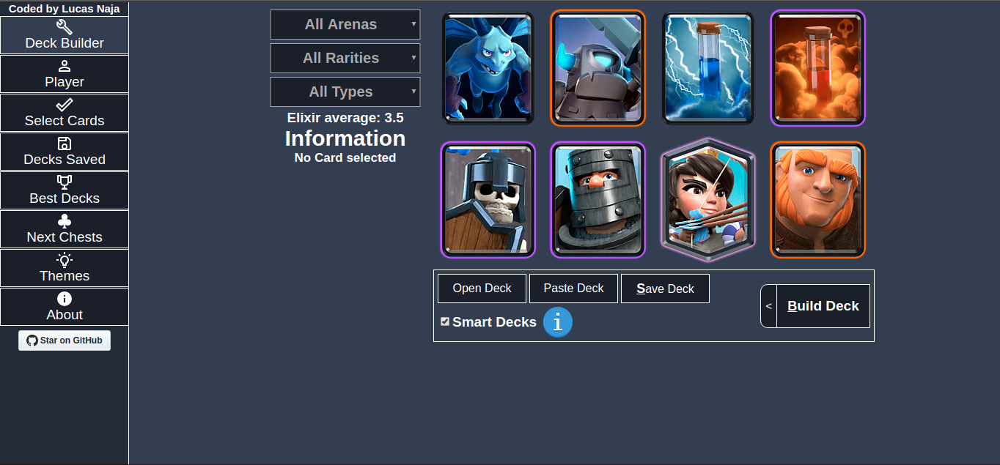

# _Deck Royale_

## An [OnLine Tool](https://deckroyale.now.sh) for Clash Royale game

### Made with  for y'all!

## Description
  _Deck Royale_ is a **Deck Builder Tool** for Clash Royale game that makes easier your friendly and personal battles.

## Why
  - Save your preferred Decks (until 100 Decks!!!)
  - Build smart Decks (personal battle)
  - Build random Decks (friendly battle)
  - Build your own Decks (personal and friendly battle)
  - Paste Decks directly into the game
  - Remove Cards you don't have
  - Filter between Arena, Rarity and Type
  - Login using your Clash Royale ID for stats view
  - See your next Chests after battle
  - Open Source ([MIT License](https://github.com/LucasNaja/deck-royale/blob/master/LICENSE))
  - Easy to use
  - Fastest Tool

## Contact
  - **[Facebook](https://www.facebook.com/Lucas.Naja0 "My Facebook")**
  - **[Twitter](https://twitter.com/LucasNaja0 "My Twitter")**
  - **[GitHub](https://github.com/LucasNaja "My GitHub")**
  - **[Portfolio](https://lucasnaja.github.io/portfolio-reactjs "My OnLine Portfolio")**

### Current build: **0.3.7**